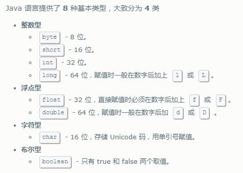

学习java基本数据类型的核心知识点如下：
> - 数据类型的分类
> - 基本类型的类型转换
> - 保持数据精度
> - 使用规范及注意事项

## 数据类型的分类

java支持的数据类型分为两类：基本数据类型 和 引用类型。

基本数据类型分为：布尔类型 和 数值类型。数值类型又可以细分为：整数类型 和 浮点类型。

整数类型包括：byte、short、int、long、char。浮点类型包括：float、double。

> char代表字符型，实际上字符型也是一种整数类型，相当于无符号整数类型。

