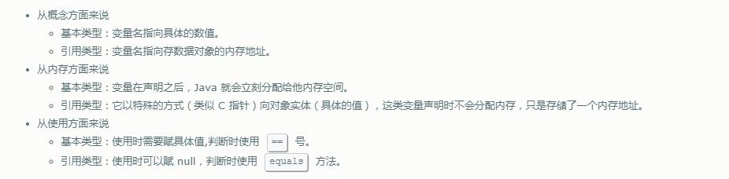

学习java基本数据类型的核心知识点如下：
> - 数据类型的分类
> - 基本类型的类型转换
> - 保持数据精度
> - 使用规范及注意事项

## 数据类型的分类

java支持的数据类型分为两类：基本数据类型 和 引用类型。

基本数据类型分为：布尔类型 和 数值类型。数值类型又可以细分为：整数类型 和 浮点类型。

整数类型包括：byte、short、int、long、char。浮点类型包括：float、double。

> char代表字符型，实际上字符型也是一种整数类型，相当于无符号整数类型。

**基本数据类型和引用类型的区别**

## 基本类型的类型转换

java语言的7种数值类型之间可以进行类型转换，分为两种：自动类型转换 和 强制类型转换

#### 自动类型转换

发生条件：当该数据类型的数值表示范围小于另一种数据类型的数值表示范围时，进行自动类型转换

> 这里我们所说的“大”与“小”，并不是指占用字节的多少，而是指表示值的范围的大小。

举例说明：
long类型的长度为8个字节，占64位，表示范围为 -2^63  -  (2^63 - 1)
java的浮点数采用二进制数据的科学计数法来表示，比如：对于float类型，第1位是符号位，接下来8位表示指数，再接下来的23位表示尾数.
