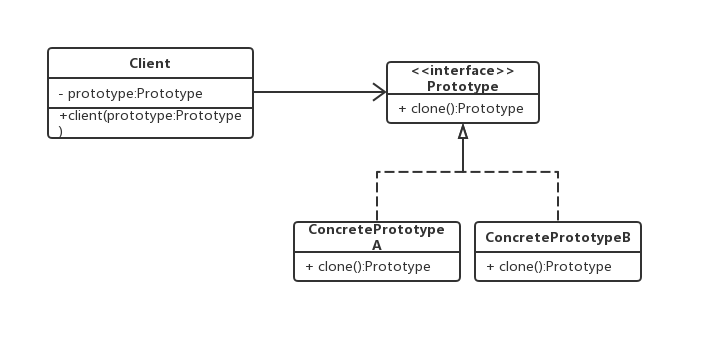

当我们要学习原型模式或者其他的设计模式时，通常需要问几个问题
> - 什么是原型模式
> - 什么时候可以派上用场
> - 具体如何实现
> - 有何优缺点

## 什么是原型模式

**原型模式（Prototype Pattern）**的定义：用原型实例指定创建对象的种类，并且通过拷贝原型实例来创建新的对象。（Specify the kind of objects to create using a prototypical instance, and create new objects by copying this prototype. ）

这里面有几个关键词，**用原型实例**说明原型模式有一个前提，就是我得先有一个实例，**拷贝**说明是复制，而不是创建，**拷贝**这个词用Java翻译，就是clone，我们后面再说。


## 原型模式怎样来实现

我们带着第二个问题，先来看第三个问题。

在讨论具体事前之前，我们先来看两个概念：**浅复制**和**深复制**

浅复制（浅克隆） ：只负责克隆按值传递的数据（比如：基本数据类型、String类型）。

深复制（深克隆） ：除了浅度克隆要克隆的值外，还负责克隆引用类型的数据，基本上就是被克隆实例所有的属性的数据都会被克隆出来。

我们先来看看浅复制。

```
public class ShallowStudent implements Cloneable{
    private String name;
    private int age;
    Professor p;

    ShallowStudent(String name, int age, Professor p) {
        this.name = name;
        this.age = age;
        this.p = p;
    }

    @Override
    public Object clone() {
        ShallowStudent o = null;
        try {
            // Object中的clone()识别出你要复制的是哪一个对象。
            o = (ShallowStudent) super.clone();
        } catch (CloneNotSupportedException e) {
            System.out.println(e.toString());
        }
        return o;
    }

    public static void main(String[] args) {
        Professor p = new Professor("jiangtao",35);
        ShallowStudent s1 = new ShallowStudent("weijieming", 18,p);
        System.out.println("复制前，原对象基本属性："+"name=" + s1.name + "," + "age=" + s1.age);
        System.out.println("复制前，原对象引用属性："+"name=" + s1.p.name + "," + "age=" + s1.p.age);
        ShallowStudent s2 = (ShallowStudent) s1.clone();
        s2.name = "like";
        s2.age = 20;
        //修改学生2后，不影响学生1的值。
        System.out.println("==========================================================");
        System.out.println("复制后，原对象基本属性："+"name=" + s1.name + "," + "age=" + s1.age);
        System.out.println("复制后，复制对象基本属性："+"name=" + s2.name + "," + "age=" + s2.age);

        s2.p.name = "zhanghuanqi";
        s2.p.age = 18;
        //修改学生2引用对象后，影响学生1的值。
        System.out.println("==========================================================");
        System.out.println("复制后，原对象引用属性："+"name=" + s1.p.name + "," + "age=" + s1.p.age);
        System.out.println("复制后，复制对象引用属性："+"name=" + s2.p.name + "," + "age=" + s2.p.age);
    }
}

class Professor {
    String name;
    int age;

    Professor(String name, int age) {
        this.name = name;
        this.age = age;
    }
}

```
这段代码的输出如下：
```
复制前，原对象基本属性：name=weijieming,age=18
复制前，原对象引用属性：name=jiangtao,age=35
==========================================================
复制后，原对象基本属性：name=weijieming,age=18
复制后，复制对象基本属性：name=like,age=20
==========================================================
复制后，原对象引用属性：name=zhanghuanqi,age=18
复制后，复制对象引用属性：name=zhanghuanqi,age=18

```

从这段代码可以看出，基本数据类型的变量都会重新创建，而引用类型，指向的还是原对象所指向的对象。





