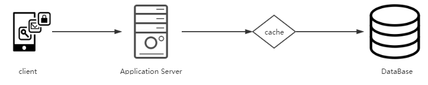
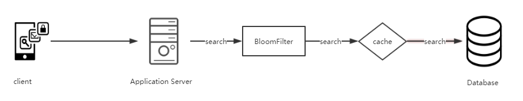

# 基本数据类型操作

> 基于redis-cli的各种操作已更新至[Redis命令](https://khakili.github.io/redis/#/ "Redis命令")，此文档会基于各种场景使用对应命令

- 热点数据缓存

	如果希望提高系统的吞吐量，减小数据库的压力，可以在应用与数据库中间加一层cache，通常Redis是最先考虑使用的，
	如下图。
	
	
	在使用缓存的时候需要注意一下几个问题：
	
	- 缓存与数据库数据一致性的问题（1）
	- 缓存击穿（2）
	- 缓存雪崩（3）

	问题（1）有如下几种办法处理：
	
	- Cache Aside（这种模式处理缓存是先从数据库缓存查询，如果缓存没有命中则从数据库中进行查找，有可能会脏读）

	- Read Through（这种模式是只从缓存里获取数据，如果缓存没有命中，则它负责使用底层提供程序插件从数据库中检索数据。 检索数据后，缓存会自行更新并将数据返回给调用应用程序，这种增加了开发难度。）

	- Write Through（这种模式是当数据发生更新的时候，先去Cache里面进行更新，如果命中了，则先更新缓存再由Cache方来更新database。如果没有命中的话，就直接更新Cache里面的数据。）

	- Write Behind Caching（这种模式通常是先将数据写入到缓存里面，然后再异步的写入到database中进行数据同步，这样的设计既可以直接的减少我们对于数据的database里面的直接访问，降低压力，同时对于database的多次修改可以进行合并操作，极大的提升了系统的承载能力，但是这种模式会存在一定的风险性，在cache宕掉的时候，缓存中的数据有可能没有写入到数据库道中，导致数据丢失。）
	
	问题（2）解决方法：
	
	- 空值缓存（如果数据库中没有查询到缓存value，则给缓存赋null或空，避免请求全部打到数据库）
	- 布隆过滤器（避免不存在的数据信息也去往存储库中进行查询情况）
	
		
		这个稍微高端一点了，首先将缓存的key预热到bloomfilter中，如果bloomfilter有则去redis查，如果redis中没有，再去数据库中查询。
	
	问题（3）解决办法：
	
	- 加锁（单机加锁，让请求一个个到达数据库，可能会将单个应用打崩）
	- 缓存预热（提前将缓存刷入缓存）
	- 本地缓存和Hystrix限流

- 计数
	
	在需要计算次数的场景下可以使用**incr**命令，设置一个Key，每次增长1，也可以使用**incrby**，每次增长指定步长。
	
- 分布式锁

	在需要加锁的逻辑里使用redis**setnx**命令，如果命令返回1，则加锁成功，如果返回0则正在由任务占用该锁。

- 排行榜

	使用redis的有序集合，可以使用zrange，获取从小到大的值排序（递增），zrevrange获取从大到小的值排序（递减）
	
- 简单队列（不推荐使用）

	- 可以使用redis队列的lpush和rpop来实现简单队列
	- 使用publish和subscribe	订阅channel

